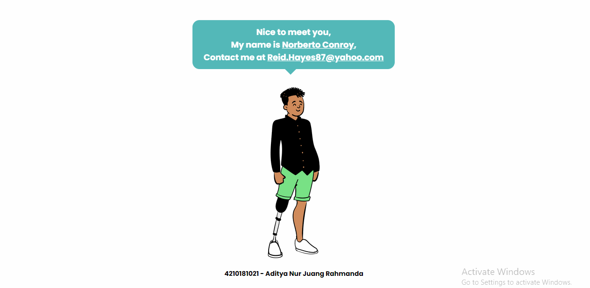

# Week 1 - Create Mini App

**4210181021 / Aditya Nur Juang Rahmanda**

Live Preview : [https://adityarahmanda.github.io/4210181021-Create-Mini-App/](https://adityarahmanda.github.io/4210181021-Create-Mini-App/)

Code : [https://github.com/adityarahmanda/4210181021-Create-Mini-App/blob/main/index.html](https://github.com/adityarahmanda/4210181021-Create-Mini-App/blob/main/index.html)

Code Description :

Mini App ini dibuat dengan menggunakan HTML, CSS, dan Javascript. 
HTML bertanggung jawab untuk layouting. 
CSS bertanggung jawab untuk animasi dan styling.
Javascript bertanggung jawab untuk parsing JSON.

GIF result :

